# Overbearer User Manual

Overbearer is a transparent man-in-the-middle proxy that intercepts bearer tokens in HTTP/HTTPS traffic and replaces them on the fly. Services use harmless **fake tokens** that only work through the proxy; the real secrets never leave the encrypted vault.

This manual walks through every view in the management console.

---

## Table of Contents

- [Authentication](#authentication)
  - [Login](#login)
  - [First-Time Setup](#first-time-setup)
- [Role-Based Access](#role-based-access)
- [Dashboard](#dashboard)
- [Tokens](#tokens)
- [Token Requests](#token-requests)
- [Logs](#logs)
- [Services](#services)
- [New Activity](#new-activity)
- [Users](#users)
- [Groups](#groups)
- [Settings](#settings)

---

## Authentication

### Login

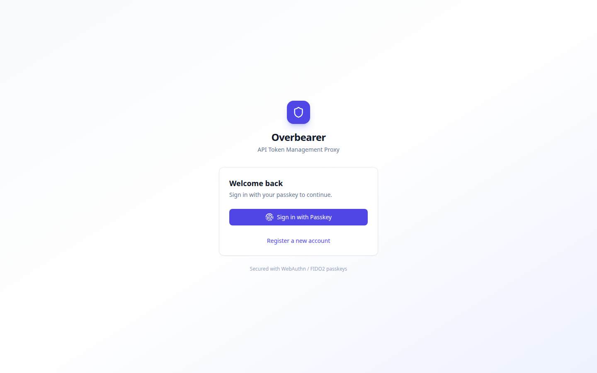

Overbearer uses **WebAuthn passkeys** exclusively -- there are no passwords. The login screen presents a single "Sign in with Passkey" button that triggers your browser's built-in passkey dialog (Touch ID, Windows Hello, hardware security key, etc.).

Below it, a "Register a new account" link lets pre-created users complete their passkey registration. Accounts must be created by an admin first; there is no open self-registration.

### First-Time Setup

When the database is empty (fresh deployment), the login page automatically switches to a **setup screen** where you choose a username and display name. This creates the first user as an **admin** and signs you in immediately -- no passkey required for this initial bootstrap. You should register a passkey afterwards from the Settings page.

---

## Role-Based Access

Overbearer has four roles, listed from lowest to highest privilege:

| Role | Sidebar Navigation | Capabilities |
|------|-------------------|--------------|
| **Requester** | Dashboard, Token Requests | Submit token access requests. View own request status. |
| **Viewer** | Dashboard, Logs, Services, New Activity | Read-only access to proxy logs and service monitoring. Logs are scoped to tokens the viewer has been granted access to. |
| **Manager** | Dashboard, Tokens, Token Requests | Create, rotate, and revoke token mappings. Approve or deny token requests. Manages tokens they created and tokens accessible via group membership. |
| **Admin** | All pages | Full access. Manage users, groups, CA certificates, proxy ACLs, and all tokens regardless of ownership. |

The sidebar adapts to show only the pages available to the current user's role. The bottom of the sidebar always displays the logged-in user's name and role.

---

## Dashboard

**Minimum role:** any authenticated user

| Admin view | Manager view |
|---|---|
|  |  |

| Viewer view | Requester view |
|---|---|
| 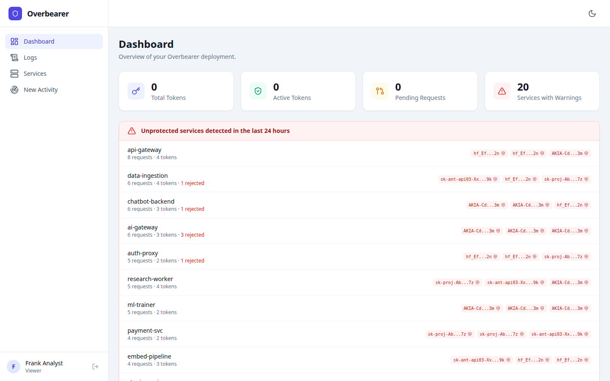 | 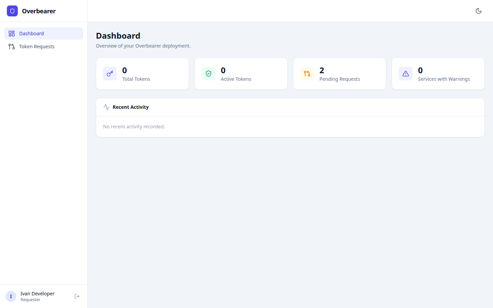 |

The dashboard provides a quick overview of the deployment through four **stat cards**:

- **Total Tokens** -- number of token mappings (active + revoked) visible to the current user.
- **Active Tokens** -- non-revoked tokens only.
- **Pending Requests** -- token requests awaiting approval.
- **Services with Warnings** -- count of services that sent real API tokens directly through the proxy in the last 24 hours, bypassing the fake-token mechanism.

### Unprotected Services Alert

When any services are detected using **real tokens directly** (i.e. not going through fake-token replacement), a red-bordered alert section appears below the stat cards. Each row shows:

- The **service name** (identified via Kubernetes pod IP resolution).
- The **request count** and number of **distinct tokens** observed.
- **Rejected count** (HTTP 403 responses).
- **Token previews** -- clickable badges showing the first/last characters of the intercepted real token. Clicking a preview opens a **Capture Token** modal that lets you automatically intercept the real token from the ClickHouse logs, encrypt it, and generate a safe fake replacement in one step.

### Recent Activity

A timeline at the bottom shows the last 10 proxy log entries, each with a colored dot indicating the token type:

- Green -- fake token (protected)
- Red -- real token used directly (unprotected)
- Gray -- unknown token type

Each entry shows the originating service, the HTTP method and path, and the timestamp.

**Note:** Lower-privilege roles see fewer stats. A requester sees 0 for tokens and services (they don't have API access to those endpoints), but can see their own pending requests count.

---

## Tokens

**Minimum role:** Manager

| Admin view | Manager view |
|---|---|
| 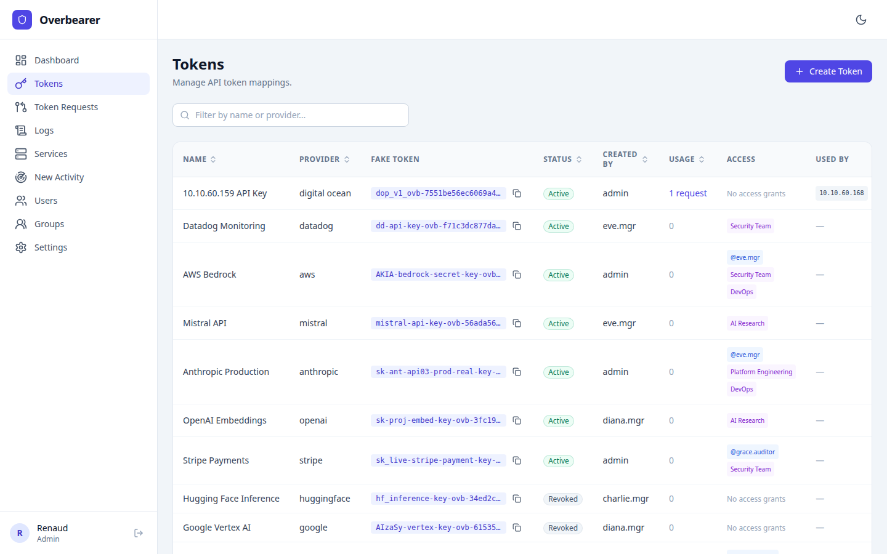 | 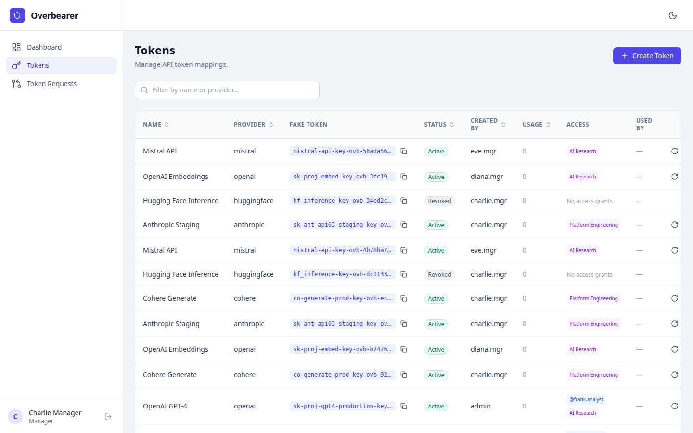 |

The Tokens page is the core of Overbearer's secret management. It displays a sortable, searchable table of all token mappings visible to the current user.

### Table Columns

| Column | Description |
|--------|-------------|
| **Name** | Human-readable label for the token mapping. |
| **Provider** | The external API provider (e.g. `anthropic`, `openai`, `stripe`). |
| **Fake Token** | The safe replacement token that services use. Shown as a monospaced code snippet with a copy button. This is the value you give to your services. |
| **Status** | `Active` (green) or `Revoked` (red). Revoked tokens are no longer replaced by the proxy. |
| **Created By** | The username of the manager or admin who created the mapping. |
| **Usage** | Number of proxy requests that used this fake token, as reported by ClickHouse. Clicking the count navigates to the Logs page filtered to that token. |
| **Access** | Shows which users (blue `@username` badges) and groups (purple badges) have been granted access to this token. |
| **Used By** | Services that have used this fake token, shown as small code badges. |

### Visibility Rules

- **Admins** see all tokens across the entire organization.
- **Managers** see tokens they created, plus tokens accessible via their group memberships or direct access grants.

### Actions

Each active token row has two action buttons in the rightmost column:

- **Rotate** (circular arrow icon) -- opens a modal to provide a new real token value. The fake token stays the same, so services don't need to change anything. Only the encrypted real secret is swapped.
- **Revoke** (ban icon) -- opens a confirmation dialog. Revoking a token marks it as inactive, removes it from the proxy's memcached cache, and causes any service still using the old fake token to get unmodified requests forwarded (the proxy no longer substitutes).

### Creating a Token

Click the **"+ Create Token"** button in the top right. The modal asks for:

1. **Name** -- a descriptive label (e.g. "Production OpenAI key").
2. **Provider** -- free-text field for the API provider.
3. **Real Token** -- the actual API secret. This is encrypted with AES-256-GCM and never stored in plaintext.

After creation, a second modal displays the generated **fake token**. This fake token preserves the prefix of the real token (e.g. `sk-ant-api03-ovb-...`) so target APIs don't reject it on format alone. Copy it and distribute it to the service owners.

### Search

The search bar above the table filters tokens by name or provider in real time.

---

## Token Requests

**Minimum role:** Requester (submit), Manager (review)

| Admin view | Manager view | Requester view |
|---|---|---|
| 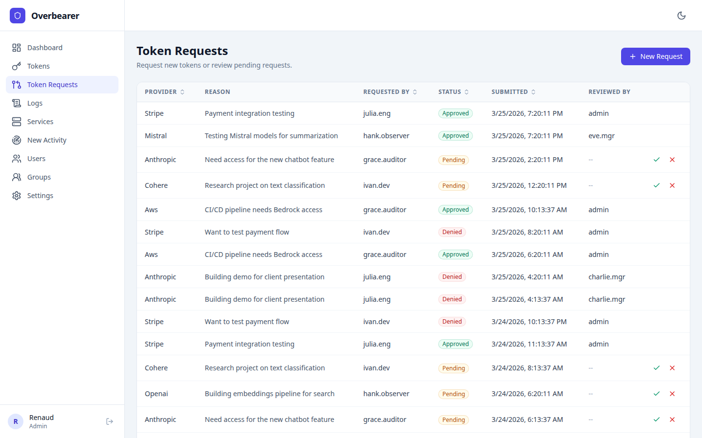 | 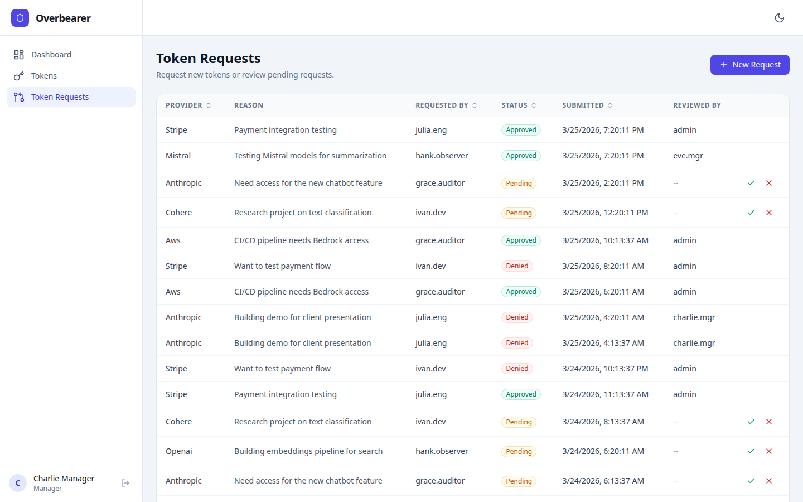 | 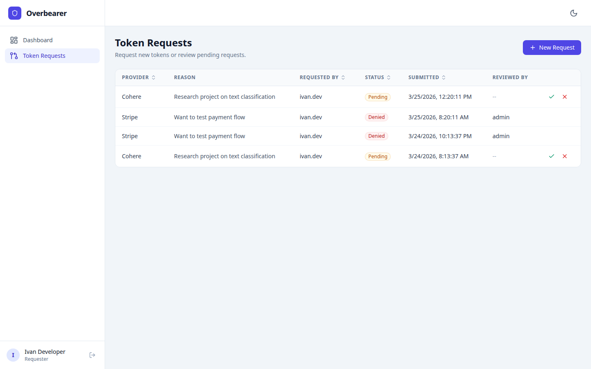 |

The Token Requests page implements a self-service workflow. Users who don't have direct token access can request it, and managers approve or deny.

### Table Columns

| Column | Description |
|--------|-------------|
| **Provider** | The external API provider being requested. |
| **Reason** | Free-text justification for the request. |
| **Requested By** | Username of the person making the request. |
| **Status** | `Pending` (orange), `Approved` (green), or `Denied` (red). |
| **Submitted** | Timestamp of when the request was created. |
| **Reviewed By** | Username of the manager/admin who acted on the request, or `--` if still pending. |

### Submitting a Request (Requester)

Click **"+ New Request"**. The modal has:

- A **Provider** dropdown (OpenAI, Anthropic, GitHub, AWS, GCP, Azure, Stripe, Other).
- A **Reason** text area explaining why the token is needed and how it will be used.

After submission the request appears with `Pending` status.

### Reviewing Requests (Manager / Admin)

Pending requests show two action buttons:

- **Approve** (green check) -- opens an approval modal where the manager provides a **Token Name** and the **Real Token** value. Approving simultaneously creates a new token mapping and grants access to the requester.
- **Deny** (red X) -- immediately marks the request as denied.

**Requesters** only see their own requests. **Managers and admins** see all requests.

---

## Logs

**Minimum role:** Viewer

| Admin view | Viewer view |
|---|---|
|  | 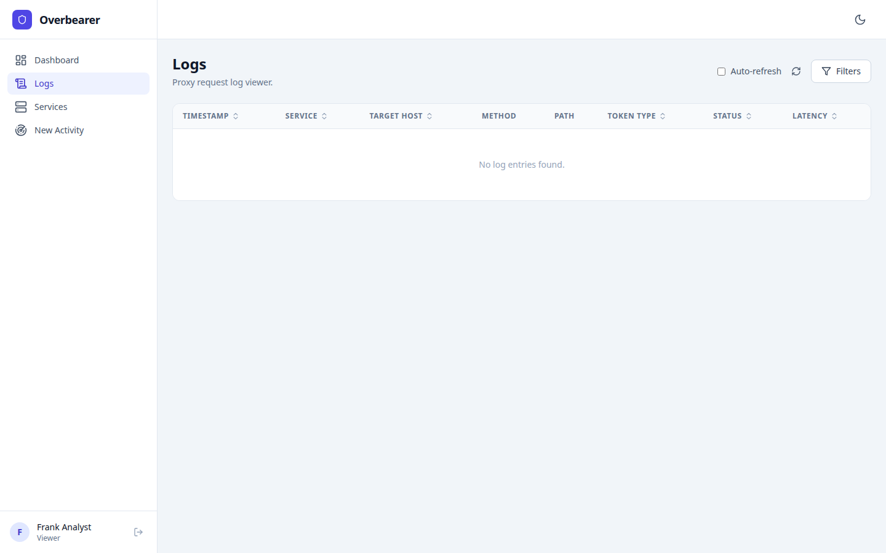 |

The Logs page is a real-time viewer for every HTTP request that flows through the Overbearer proxy. Log data is stored in ClickHouse and supports high-volume time-series queries.

### Table Columns

| Column | Description |
|--------|-------------|
| **Timestamp** | When the request was proxied, with millisecond precision. |
| **Service** | The originating Kubernetes service name (resolved from pod IP). |
| **Target Host** | The external API hostname (e.g. `api.anthropic.com`). |
| **Method** | HTTP method (`GET`, `POST`, `PUT`, `DELETE`). |
| **Path** | The request path (e.g. `/v1/messages`). |
| **Token Type** | Color-coded badge: **Fake** (green) = properly replaced, **Real (Direct)** (red) = real token seen in the wild, **Unknown** (gray) = no recognized token header. |
| **Status** | HTTP response status code, color-coded: green for 2xx, amber for 3xx/4xx, red for 5xx. |
| **Latency** | Round-trip time in milliseconds. |

### Filtering

Click the **"Filters"** button in the top right to expand a panel with five filter fields:

- **Start Date** / **End Date** -- datetime pickers to narrow the time range.
- **Service** -- filter by originating service name.
- **Target Host** -- filter by destination hostname.
- **Token Type** -- dropdown: All, Fake, Real (Direct), Unknown.

Filters are applied server-side and the table paginates (25 rows per page).

### Auto-refresh

Toggle the **"Auto-refresh"** checkbox to poll for new log entries every 5 seconds. The refresh icon spins while loading.

### Viewer Scoping

**Viewers** only see logs for tokens they have been explicitly granted access to (via direct user access or group membership). If no access has been granted, the table is empty. **Admins** see all logs with no restrictions.

---

## Services

**Minimum role:** Viewer

| Admin view | Viewer view |
|---|---|
| 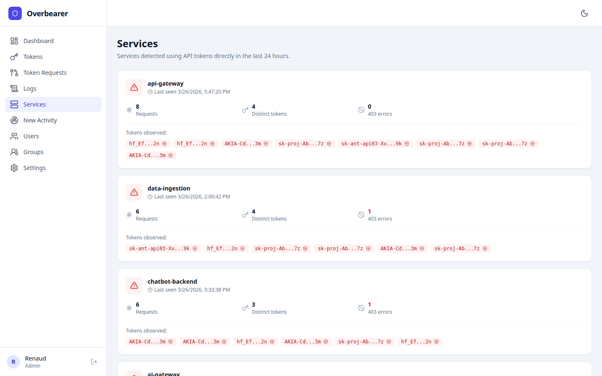 | 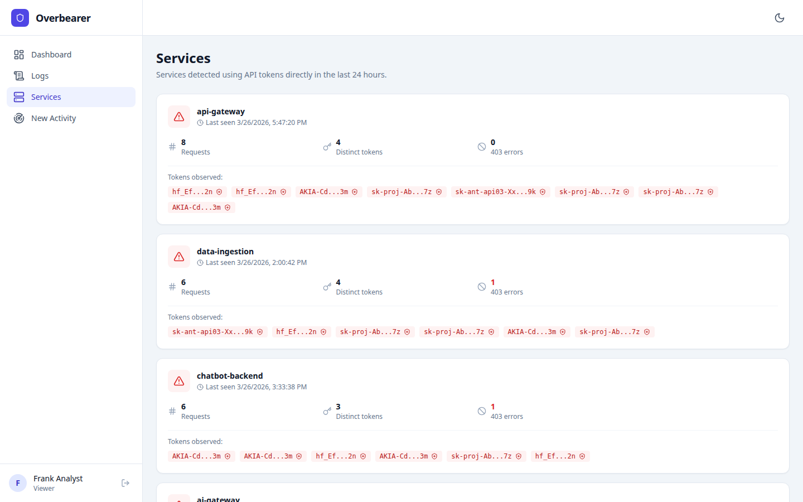 |

The Services page highlights a critical security concern: **services that are sending real API tokens directly** through the proxy instead of using fake tokens. These are services that haven't been onboarded to Overbearer yet.

Each service is displayed as an expandable card showing:

- **Service name** -- the Kubernetes service that was detected.
- **Request count** and **distinct token count** in the last 24 hours.
- **Forbidden count** -- how many requests received HTTP 403 (ACL denied).
- **Last seen** timestamp.
- **Token previews** -- the first/last characters of each unique real token observed. Each preview is a clickable red badge.

### One-Click Token Capture

Clicking a token preview badge opens a **Capture Token** modal (same as on the Dashboard). The proxy's ClickHouse logs contain the full encrypted real token; the capture flow:

1. Looks up the encrypted token from the logs.
2. Decrypts it using the master key.
3. Creates a new fake-token mapping.
4. Returns the generated fake token for you to distribute.

This lets you onboard unprotected services without ever asking the service owner for the real token -- the proxy already intercepted it.

---

## New Activity

**Minimum role:** Viewer

| Admin view | Viewer view |
|---|---|
| 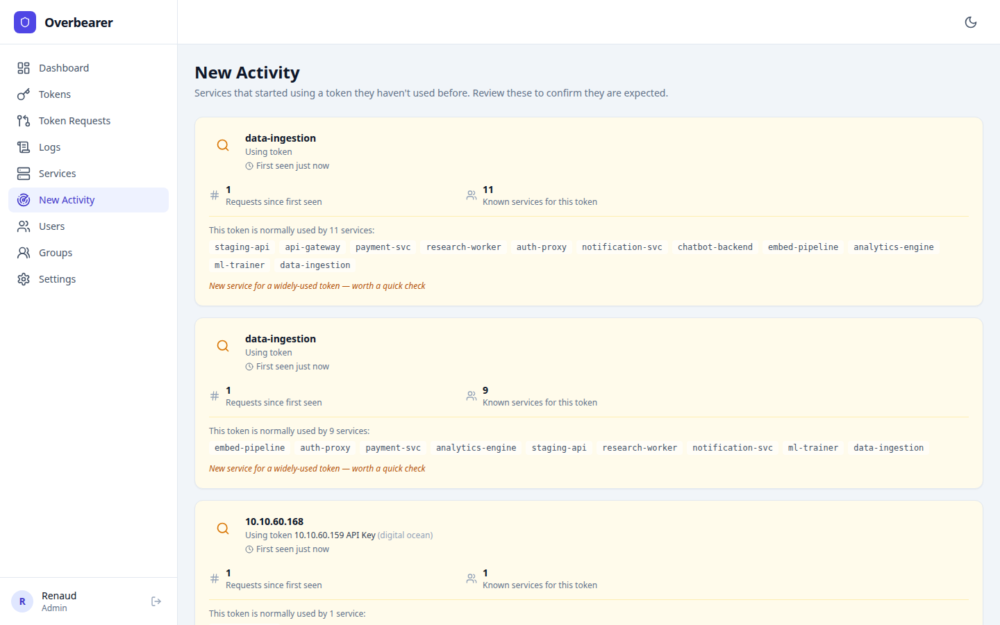 | 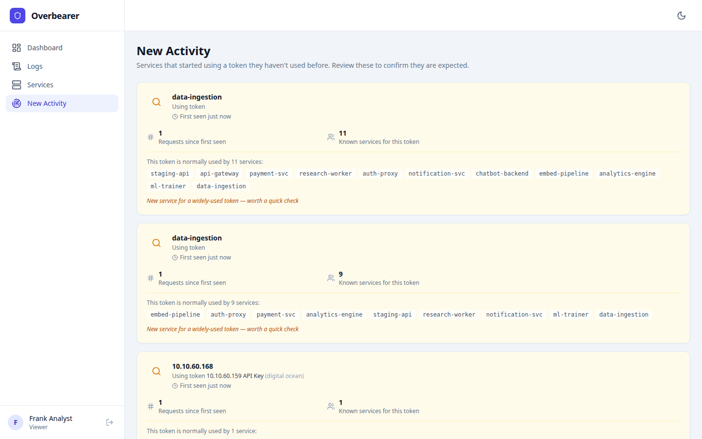 |

The New Activity page surfaces **new service-token associations** -- cases where a service started using a token it has never used before. This is an anomaly-detection view useful for spotting:

- A service that was just given a new token.
- A token that leaked to an unexpected service.
- A lateral movement attempt in the network.

Each card shows:

- **Token name and provider** (resolved from PostgreSQL) with the token ID.
- **First seen** timestamp (relative, e.g. "5 hours ago") and absolute date.
- **Request count** since first use.
- The list of **all known services** that currently use this token, so you can compare expected vs. unexpected usage.
- A link: "View events for [token] used from [service]" that navigates to the Logs page pre-filtered.

The lookback window defaults to 24 hours. When no new associations are detected, a green "All clear" message is shown.

---

## Users

**Minimum role:** Admin

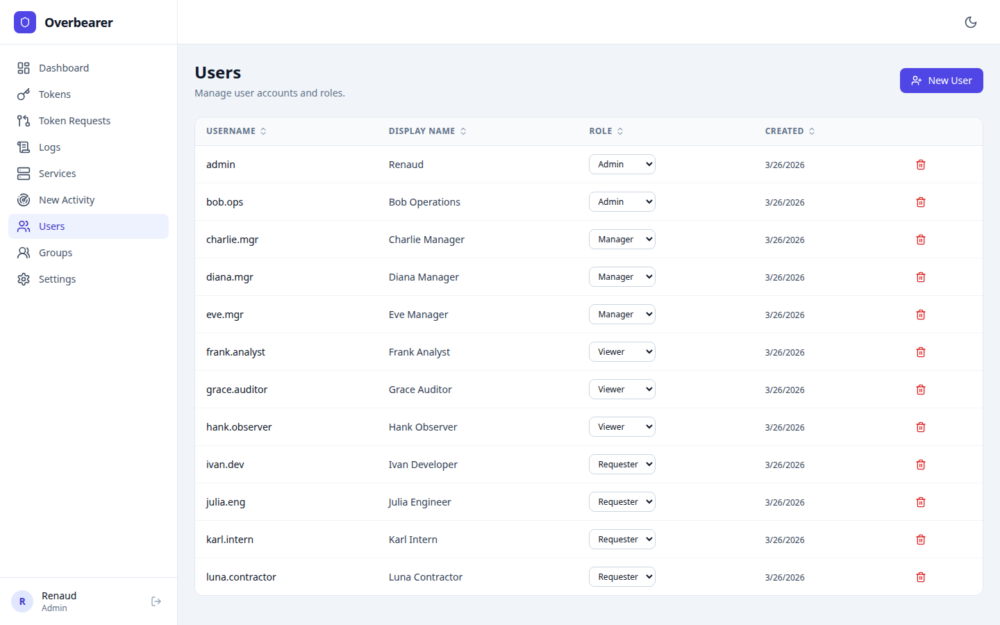

The Users page lets admins manage accounts and their roles. The table shows:

| Column | Description |
|--------|-------------|
| **Username** | The unique login identifier. |
| **Display Name** | Human-readable name shown in the sidebar and audit logs. |
| **Role** | An inline dropdown selector that lets admins change a user's role instantly. Options: Admin, Manager, Viewer, Requester. |
| **Created** | Account creation date. |
| **Delete** | Red trash icon to permanently delete a user (with confirmation dialog). |

### Creating a User

Click **"+ New User"** to open the creation modal:

1. **Username** -- must be unique, 2-255 characters.
2. **Display Name** -- optional; defaults to the username.
3. **Role** -- select from the four roles.

Clicking **"Create & Generate Invite"** creates the user account and generates a one-time **invite link** valid for 7 days. Copy this link and send it to the new user. When they visit the link, they'll register a passkey and gain access.

---

## Groups

**Minimum role:** Admin

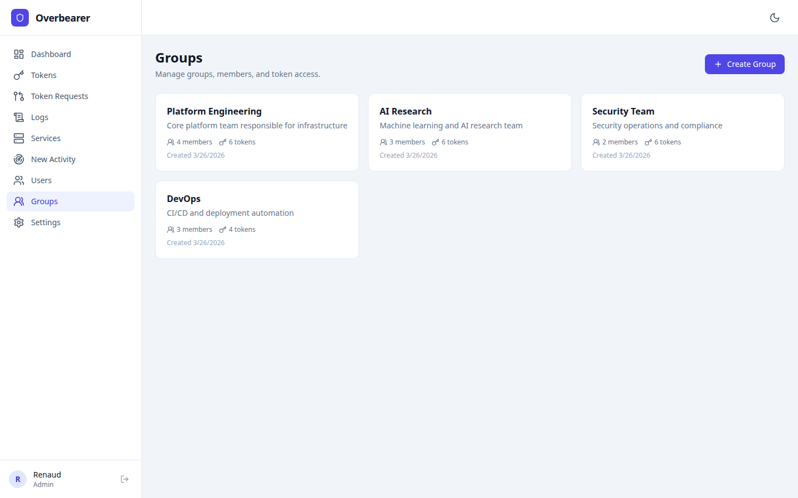

Groups let you organize users into teams and manage token access in bulk. Each group is displayed as a card showing:

- **Group name** and **description**.
- **Member count** (user icon with number).
- **Token count** (key icon with number) -- how many tokens the group has been granted access to.
- **Creation date**.

### Creating a Group

Click **"+ Create Group"** and provide a name and optional description.

### Group-Level Token Access

When a token is granted to a group (via the API), all members of that group inherit access. This is used by the Tokens page's access display (the purple badges) and by the log scoping logic for viewers. For example, if the "Platform Engineering" group has 4 members and access to 6 tokens, all 4 members can see logs for those 6 tokens.

Group membership is managed via the group detail view (click a group card).

---

## Settings

**Minimum role:** Admin

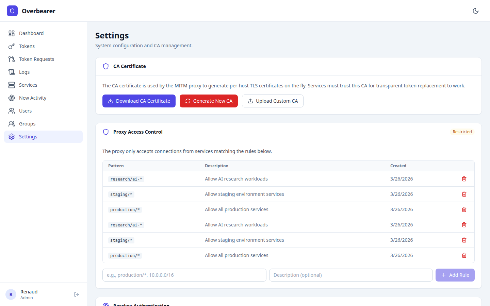

The Settings page has four sections:

### CA Certificate

The MITM proxy generates per-host TLS certificates on the fly, signed by a private Certificate Authority (CA). Services must trust this CA for transparent token replacement to work.

Three actions are available:

- **Download CA Certificate** -- downloads the current CA's public certificate in PEM format. Distribute this to services that need to trust the proxy.
- **Generate New CA** -- creates a fresh CA key pair. This **invalidates all existing per-host certificates** and requires services to trust the new CA. A confirmation dialog warns about this.
- **Upload Custom CA** -- expand an inline form to paste or upload your own CA certificate and private key in PEM format. The private key is encrypted at rest using AES-256-GCM.

### Proxy Access Control

Controls which services can use the proxy. Operates in two modes:

- **Open** (green badge) -- any service can route traffic through the proxy. A warning banner highlights the security risk of an open proxy.
- **Restricted** (amber badge) -- only services matching the configured ACL rules can connect.

The ACL rules table shows:

| Column | Description |
|--------|-------------|
| **Pattern** | A glob-style pattern (e.g. `production/*`, `10.0.0.0/16`). |
| **Description** | Optional human-readable description. |
| **Created** | When the rule was added. |
| **Delete** | Red trash icon to remove the rule. |

Adding the first rule switches the proxy from Open to Restricted mode. Deleting all rules switches it back to Open.

New rules are added via the inline form at the bottom of the section (pattern + optional description + "Add Rule" button).

### Passkey Authentication

Shows the current user's passkey status:

- If a passkey is registered: a green checkmark with "Passkey registered. You can sign in with your passkey."
- If no passkey: a prompt to register one, with a "Register Passkey" button that triggers the browser's WebAuthn flow.

### System Information

Displays read-only metadata: product name, UI version, architecture description, and authentication method.

---

## Appendix: Sidebar Comparison by Role

For quick reference, here is the sidebar navigation as seen by each role:

| Admin | Manager | Viewer | Requester |
|-------|---------|--------|-----------|
| Dashboard | Dashboard | Dashboard | Dashboard |
| Tokens | Tokens | Logs | Token Requests |
| Token Requests | Token Requests | Services | |
| Logs | | New Activity | |
| Services | | | |
| New Activity | | | |
| Users | | | |
| Groups | | | |
| Settings | | | |
