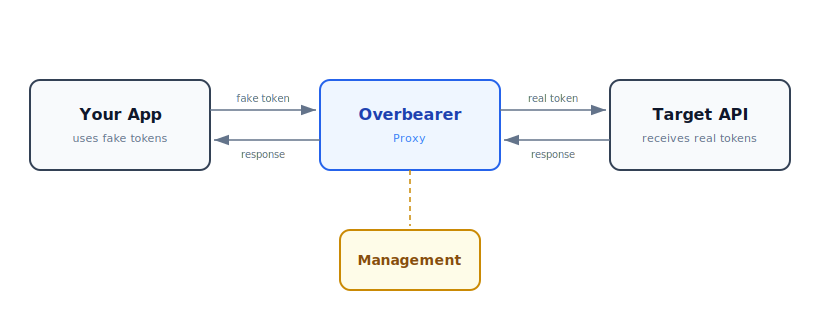

# Overbearer

**Bearer tokens are a ticking time bomb. Overbearer defuses them.**

---

## Why

Every bearer token is a single point of failure. It sits in an environment variable, a config file, a CI secret — and the moment any link in your supply chain is compromised, that token walks out the door. You rotate it, patch the leak, and hope it doesn't happen again. But it will.

The problem isn't how you *store* tokens. The problem is that the token your service uses *is the real token*. If it leaks, the attacker has the keys to the kingdom.

**What if the tokens in your runtime were completely worthless to an attacker?**

## What

Overbearer is a transparent MiTM proxy that sits between your services and the APIs they call. Your services use **fake tokens** — meaningless strings that are useless outside your infrastructure. Overbearer intercepts outgoing requests and swaps the fake token for the real one on the fly.

- Your services never see, store, or transmit real API keys
- If a fake token leaks, it's worthless — it only works through Overbearer
- Real tokens live in one place: Overbearer's encrypted vault
- Full audit trail of which service used which token, when

## How

Overbearer performs TLS interception using a private Certificate Authority that you control. It inspects `Authorization: Bearer` and `x-api-key` headers, replacing fake tokens with their real counterparts from an encrypted, in-memory cache.

### Architecture



### Key features

- **Zero-latency design**: Token lookup via memcached, TLS cert caching, async logging — adds <2ms to requests
- **Horizontally scalable**: Run as many proxy instances as you need. All state is in memcached/PostgreSQL
- **Passkey-only auth**: The management console uses WebAuthn passkeys. No passwords. No phishing.
- **RBAC**: Four roles — `requester`, `manager`, `viewer`, `admin` — each with precisely scoped permissions
- **Audit everything**: All proxy traffic is logged to ClickHouse with 90-day retention
- **Leak detection**: Overbearer flags services that are using real tokens directly, so you can fix them
- **Encrypted at rest**: Real tokens are AES-256-GCM encrypted in PostgreSQL and in memcached

---

## Getting Started

### Prerequisites

- Kubernetes cluster (or Docker Compose for local development)
- `kubectl` configured
- `docker` installed

### Quick Start (Docker Compose)

```bash
# Clone the repository
git clone https://github.com/your-org/overbearer.git
cd overbearer

# Install dependencies
npm install

# Start all services locally
docker compose up -d

# The management UI is at http://localhost:3000
# The proxy listens on port 8080
```

### Kubernetes Deployment

```bash
# Create the namespace and deploy infrastructure
kubectl apply -f k8s/namespace.yaml
kubectl apply -f k8s/secrets.yaml      # ⚠️ Change the default secrets first!
kubectl apply -f k8s/postgres/
kubectl apply -f k8s/clickhouse/
kubectl apply -f k8s/memcached/

# Wait for infrastructure to be ready
kubectl -n overbearer wait --for=condition=ready pod -l app=postgres --timeout=60s
kubectl -n overbearer wait --for=condition=ready pod -l app=clickhouse --timeout=60s
kubectl -n overbearer wait --for=condition=ready pod -l app=memcached --timeout=60s

# Deploy Overbearer
kubectl apply -f k8s/management/
kubectl apply -f k8s/proxy/
```

### Initial Setup

1. Open the management console
2. Register your first account (automatically gets `admin` role)
3. Generate a CA certificate: **Settings → Generate CA**
4. Download the CA certificate and add it to your services' trust store
5. Configure your services to use the proxy (set `HTTPS_PROXY=http://overbearer-proxy:8080`)
6. Create token mappings: add your real API keys and get fake tokens back
7. Replace the real tokens in your services with the fake ones

### Configuring Your Services

Add Overbearer's CA certificate to your service's trust store and point it at the proxy:

```dockerfile
# In your Dockerfile
COPY overbearer-ca.pem /usr/local/share/ca-certificates/overbearer.crt
RUN update-ca-certificates

ENV HTTPS_PROXY=http://overbearer-proxy.overbearer.svc.cluster.local:8080
ENV NODE_EXTRA_CA_CERTS=/usr/local/share/ca-certificates/overbearer.crt
```

```yaml
# In your Kubernetes deployment
env:
  - name: HTTPS_PROXY
    value: "http://overbearer-proxy.overbearer.svc.cluster.local:8080"
  - name: ANTHROPIC_API_KEY
    value: "ovb_your_fake_token_here"  # This is worthless without Overbearer
```

---

## Security Model

| Layer | Protection |
|-------|-----------|
| Token storage | AES-256-GCM encryption with master key from K8s Secret |
| Memcached cache | Same AES-256-GCM encryption — cache compromise reveals nothing |
| Management auth | Passkeys only — phishing-resistant, no passwords |
| API access | Role-based access control on every endpoint |
| Proxy TLS | Validates upstream certificates, rejects invalid certs with 503 |
| Audit trail | All token usage logged to ClickHouse |

### What if Overbearer itself is compromised?

The master encryption key is a Kubernetes Secret. If the proxy pods are compromised, the attacker gets the key and the encrypted tokens. This is the same threat model as any secrets manager — the difference is that Overbearer is a controlled, auditable chokepoint rather than secrets scattered across dozens of services.

---

## FAQ

### Why replace tokens on the fly instead of just securing where they're stored?

Because securing storage doesn't solve the real problem. A token stored in an environment variable, a CI secret, or a config file is one supply-chain compromise away from walking out the door — no matter how well you encrypted it at rest. With Overbearer, the tokens in your runtime are *fake*. Even if an attacker compromises a service, exfiltrates its environment, or intercepts its traffic outside your network, the stolen token is worthless — it only resolves to a real credential when routed through Overbearer inside your infrastructure. The attacker would need to maintain a persistent foothold *inside* your environment and route traffic through the proxy to make use of it, which is a dramatically higher bar than simply pasting a leaked key into a curl command.

### How do I configure my apps to use Overbearer?

Two steps: trust the proxy's CA certificate, and set the proxy environment variables.

**1. Get the CA certificate**

Download it from the management console under **Settings → CA Certificate → Download**, or fetch it from the API:

```bash
curl -o overbearer-ca.pem https://overbearer-mgmt.internal/api/v1/ca/certificate
```

Then add it to your service's trust store:

```bash
# Debian/Ubuntu
sudo cp overbearer-ca.pem /usr/local/share/ca-certificates/overbearer.crt
sudo update-ca-certificates

# Alpine
cp overbearer-ca.pem /usr/local/share/ca-certificates/overbearer.crt
update-ca-certificates

# RHEL/Fedora
sudo cp overbearer-ca.pem /etc/pki/ca-trust/source/anchors/overbearer.crt
sudo update-ca-trust
```

For Node.js, you can also use the `NODE_EXTRA_CA_CERTS` environment variable instead of modifying the system store.

**2. Set the proxy environment variables**

Point your services at the Overbearer proxy by setting all four standard proxy variables:

```bash
export HTTP_PROXY=http://overbearer-proxy:8080
export HTTPS_PROXY=http://overbearer-proxy:8080
export http_proxy=http://overbearer-proxy:8080
export https_proxy=http://overbearer-proxy:8080
```

Most HTTP clients (curl, Python `requests`, Node.js `axios`/`undici`, Go's `net/http`) respect these variables automatically. Setting both upper- and lower-case variants ensures compatibility across languages and libraries.

### Is this production ready?

No. Overbearer is a **research project** exploring the idea of runtime token indirection. It has not been audited, load-tested at scale, or hardened for production use. Use it in lab environments and proof-of-concept setups — not in front of real customer traffic.

### Are there better solutions for securing service-to-service authentication?

Yes, depending on your threat model. Mutual TLS (mTLS) eliminates bearer tokens entirely by authenticating both sides of a connection with certificates. Identity-aware proxies like those in service meshes (Istio, Linkerd) provide similar guarantees at the infrastructure level. Cloud-native solutions like AWS IAM roles, GCP Workload Identity, or Azure Managed Identities avoid long-lived secrets altogether. Overbearer is most useful when you're consuming *third-party* APIs that require bearer tokens and you can't control the authentication mechanism on the other end.

### Where should I deploy Overbearer?

Inside your own infrastructure — a VPC, an on-prem Kubernetes cluster, or any environment where you control the network boundary. The proxy must sit on the network path between your services and the outside world. Never expose Overbearer's management console or proxy port to the public internet. The entire security model relies on the proxy being an internal-only component that attackers cannot reach directly.

### Does Overbearer add latency to my requests?

Minimal. Token lookup is done via memcached (sub-millisecond), TLS certificates are cached after first generation, and audit logging is asynchronous. In benchmarks, the proxy adds under 2ms to request round-trip time. The TLS handshake on the first request to a new domain takes slightly longer due to certificate generation, but subsequent requests reuse the cached certificate.

### What happens if Overbearer goes down?

Your services will fail to reach external APIs — the proxy is on the critical path. This is by design: it's better to fail closed than to fall back to using real tokens. Run multiple proxy replicas behind a load balancer and monitor them like you would any other critical infrastructure component. All proxy state lives in memcached and PostgreSQL, so individual proxy pods are stateless and can be replaced freely.

### Can I use Overbearer with non-HTTP protocols?

No. Overbearer only intercepts HTTP and HTTPS traffic. It specifically looks for `Authorization: Bearer` and `x-api-key` headers. If your services communicate over gRPC, WebSockets, or other protocols that carry tokens differently, Overbearer won't help.

---

## Development

```bash
# Install dependencies
npm install

# Start infrastructure
docker compose up -d postgres memcached clickhouse

# Run the API in dev mode
npm run dev:api

# Run the UI in dev mode (separate terminal)
npm run dev:ui

# Run the proxy in dev mode (separate terminal)
npm run dev:proxy

# Run tests
npm test
```

---

## License

MIT
