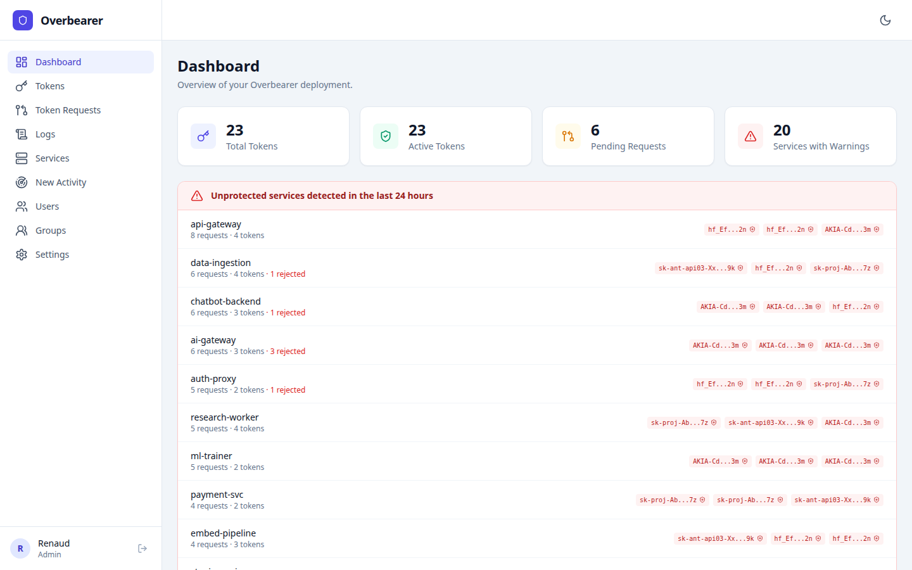
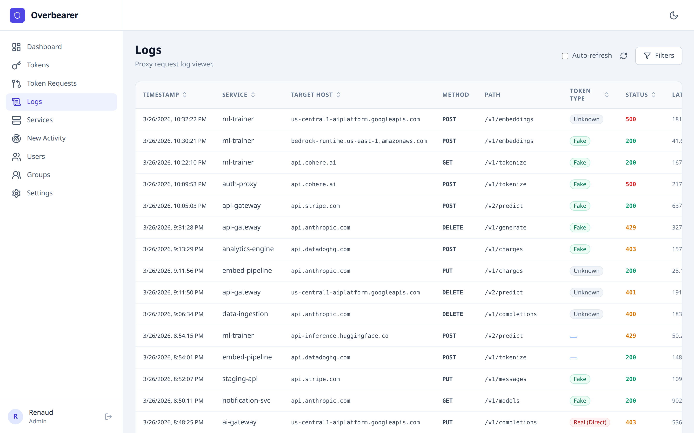

# Overbearer

https://overbearer.io

---

## Why

Every bearer token is a single point of failure. We treat them with reverence — we lock them in secret vaults in Jenkins, in Kubernetes, in HSMs. We only show them once. We act like they're state secrets. And yet, at runtime, your typical bearer token sits in an environment variable or a config file. The moment any link in your supply chain is compromised, that token walks out the door. You rotate it, patch the leak, and hope it doesn't happen again. But it will.

The problem isn't how you *store* tokens. The problem is that the token your service uses *is the real token*. If it leaks, the attacker has the keys to the kingdom.

**What if the tokens in your runtime were completely worthless to an attacker?**

## What

Overbearer is a transparent MiTM proxy that sits between your services and the APIs they call. Your services use **fake tokens** — meaningless strings that are useless outside your infrastructure. Overbearer intercepts outgoing requests and swaps the fake token for the real one on the fly.

- Your services never see, store, or transmit real API keys
- If a fake token leaks, it's worthless — it only works through Overbearer
- Real tokens live in one place: Overbearer's encrypted vault
- Full audit trail of which service used which token, when

<p align="center">
  
</p>

## How

Overbearer performs TLS interception using a private Certificate Authority that you control. It inspects `Authorization: Bearer` and `x-api-key` headers, replacing fake tokens with their real counterparts from an encrypted, in-memory cache.

### Architecture


### Key features

- **Zero-latency design**: Token lookup via memcached, TLS cert caching, async logging — adds <2ms to requests
- **Horizontally scalable**: Run as many proxy instances as you need. All state is in memcached/PostgreSQL
- **Passkey-only auth**: The management console uses WebAuthn passkeys. No passwords. No phishing.
- **RBAC**: Four roles — `requester`, `manager`, `viewer`, `admin` — each with precisely scoped permissions
- **Audit everything**: All proxy traffic is logged to ClickHouse with 90-day retention
- **Leak detection**: Overbearer flags services that are using real tokens directly, so you can fix them
- **Encrypted at rest**: Real tokens are AES-256-GCM encrypted in PostgreSQL and in memcached

<p align="center">
  
</p>

---

## Getting Started

### Prerequisites

- Kubernetes cluster (or Docker Compose for local development)
- `kubectl` configured
- `docker` installed

### Deployment

Overbearer runs on Kubernetes. The interactive setup script generates all the manifests you need, tailored to your environment.

#### 1. Run the setup script

```bash
git clone https://github.com/rderaison/overbearer.git
cd overbearer
bash setup.sh
```

The script walks you through configuration — it will ask for:

- **Namespace** and **container registry/tag** for your images
- **Hostnames** for the management UI and the proxy (used for TLS certificates and WebAuthn passkey configuration)
- **Networking** — whether to use LoadBalancer services (for cloud or MetalLB) and optional static IPs
- **Storage class** — provide one for persistent volumes, or leave empty to use `emptyDir` for testing
- **Kafka** — optionally point to your Kafka brokers for production-grade log shipping to ClickHouse
- **Scaling** — min and max replicas for the proxy's HorizontalPodAutoscaler

The script generates cryptographic secrets (master encryption key, JWT secret, PostgreSQL password) automatically and writes all manifests into a `./generated/` directory.

#### 2. Apply the generated manifests

```bash
kubectl apply -f generated/01-namespace.yaml
kubectl apply -f generated/02-secrets.yaml
kubectl apply -f generated/storage/
kubectl apply -f generated/network/

# Wait for infrastructure to be ready
kubectl -n <namespace> wait --for=condition=ready pod -l app=postgres --timeout=60s
kubectl -n <namespace> wait --for=condition=ready pod -l app=clickhouse --timeout=60s
kubectl -n <namespace> wait --for=condition=ready pod -l app=memcached --timeout=60s

# Deploy Overbearer
kubectl apply -f generated/deployments/
```

> **Important:** `generated/02-secrets.yaml` contains your encryption keys. Back it up securely and do not commit it to version control.

#### 3. Initial setup

1. Open the management console at `https://<mgmt-hostname>/`
2. Register your first account (automatically gets `admin` role)
3. Generate a CA certificate: **Settings → Generate CA**
4. Create token mappings: add your real API keys and get fake tokens back
5. Configure your services to use the proxy (see below)

### Configuring Your Services

Each service needs two things: trust the Overbearer CA, and route traffic through the proxy. See the [FAQ entry on configuring apps](#how-do-i-configure-my-apps-to-use-overbearer) for detailed instructions.

---

## Security Model

| Layer | Protection |
|-------|-----------|
| Token storage | AES-256-GCM encryption with master key from K8s Secret |
| Memcached cache | Same AES-256-GCM encryption — cache compromise reveals nothing |
| Management auth | Passkeys only — phishing-resistant, no passwords |
| API access | Role-based access control on every endpoint |
| Proxy TLS | Validates upstream certificates, rejects invalid certs with 503 |
| Audit trail | All token usage logged to ClickHouse |

### Why passkeys?

The management console — where tokens are created, rotated, and revoked — is the most sensitive part of Overbearer. If an attacker gains access to it, they can exfiltrate every real token in the system. Traditional password-based authentication is vulnerable to phishing, credential stuffing, and password reuse. Overbearer eliminates this attack surface entirely by using WebAuthn passkeys as the sole authentication method. Passkeys are bound to the origin, so they cannot be phished. There is no password to steal, no session token to intercept during login, and no credential database to breach. An attacker would need physical access to the user's authenticator device.

### What if Overbearer itself is compromised?

The master encryption key is a Kubernetes Secret. If the proxy pods are compromised, the attacker gets the key and the encrypted tokens. This is the same threat model as any secrets manager — the difference is that Overbearer is a controlled, auditable chokepoint rather than secrets scattered across dozens of services.

---

## FAQ

### Why replace tokens on the fly instead of just securing where they're stored?

Because securing storage doesn't solve the real problem. A token stored in an environment variable, a CI secret, or a config file is one supply-chain compromise away from walking out the door — no matter how well you encrypted it at rest. With Overbearer, the tokens in your runtime are *fake*. Even if an attacker compromises a service, exfiltrates its environment, or intercepts its traffic outside your network, the stolen token is worthless — it only resolves to a real credential when routed through Overbearer inside your infrastructure. The attacker would need to maintain a persistent foothold *inside* your environment and route traffic through the proxy to make use of it, which is a dramatically higher bar than simply pasting a leaked key into a curl command.

### How do I configure my apps to use Overbearer?

Two steps: trust the proxy's CA certificate, and route traffic through the proxy.

Download the CA certificate from the management console under **Settings → CA Certificate → Download**, or fetch it from the API:

```bash
curl -o overbearer-ca.pem https://<mgmt-hostname>/api/ca
```

Then add the following to your service's Dockerfile:

**Alpine-based image**

```dockerfile
# Install the Overbearer CA certificate
RUN apk add --no-cache ca-certificates
COPY overbearer-ca.pem /usr/local/share/ca-certificates/overbearer.crt
RUN update-ca-certificates

# Route all traffic through the Overbearer proxy
ENV HTTP_PROXY=http://overbearer-proxy:8080 \
    HTTPS_PROXY=http://overbearer-proxy:8080 \
    http_proxy=http://overbearer-proxy:8080 \
    https_proxy=http://overbearer-proxy:8080
```

**Debian/Ubuntu-based image**

```dockerfile
# Install the Overbearer CA certificate
COPY overbearer-ca.pem /usr/local/share/ca-certificates/overbearer.crt
RUN apt-get update && apt-get install -y --no-install-recommends ca-certificates \
    && update-ca-certificates \
    && rm -rf /var/lib/apt/lists/*

# Route all traffic through the Overbearer proxy
ENV HTTP_PROXY=http://overbearer-proxy:8080 \
    HTTPS_PROXY=http://overbearer-proxy:8080 \
    http_proxy=http://overbearer-proxy:8080 \
    https_proxy=http://overbearer-proxy:8080
```

> **Note:** Replace `overbearer-proxy` with the actual DNS name or address of the proxy service in your cluster (e.g., `overbearer-proxy.<namespace>.svc.cluster.local`).

Most HTTP clients (curl, Python `requests`, Node.js `axios`/`undici`, Go's `net/http`) respect the proxy environment variables automatically. Setting both upper- and lower-case variants ensures compatibility across languages and libraries.

For Node.js, you can also use `NODE_EXTRA_CA_CERTS=/usr/local/share/ca-certificates/overbearer.crt` instead of `update-ca-certificates` if you prefer not to modify the system trust store.

### Is this production ready?

No. Overbearer is a **research project** exploring the idea of runtime token indirection. It has not been audited, load-tested at scale, or hardened for production use. Use it in lab environments and proof-of-concept setups — not in front of real customer traffic.

### Are there better solutions for securing service-to-service authentication?

Yes, depending on your threat model. Mutual TLS (mTLS) eliminates bearer tokens entirely by authenticating both sides of a connection with certificates. Identity-aware proxies like those in service meshes (Istio, Linkerd) provide similar guarantees at the infrastructure level. Cloud-native solutions like AWS IAM roles, GCP Workload Identity, or Azure Managed Identities avoid long-lived secrets altogether. Overbearer is most useful when you're consuming *third-party* APIs that require bearer tokens and you can't control the authentication mechanism on the other end.

### Where should I deploy Overbearer?

Inside your own infrastructure — a VPC, an on-prem Kubernetes cluster, or any environment where you control the network boundary. The proxy must sit on the network path between your services and the outside world. Never expose Overbearer's management console or proxy port to the public internet. The entire security model relies on the proxy being an internal-only component that attackers cannot reach directly.

### Does Overbearer add latency to my requests?

Minimal. Token lookup is done via memcached (sub-millisecond), TLS certificates are cached after first generation, and audit logging is asynchronous. In benchmarks, the proxy adds under 2ms to request round-trip time. The TLS handshake on the first request to a new domain takes slightly longer due to certificate generation, but subsequent requests reuse the cached certificate.

### What happens if Overbearer goes down?

Your services will fail to reach external APIs — the proxy is on the critical path. This is by design: it's better to fail closed than to fall back to using real tokens. Run multiple proxy replicas behind a load balancer and monitor them like you would any other critical infrastructure component. All proxy state lives in memcached and PostgreSQL, so individual proxy pods are stateless and can be replaced freely.

### Can I use Overbearer with non-HTTP protocols?

No. Overbearer only intercepts HTTP and HTTPS traffic. It specifically looks for `Authorization: Bearer` and `x-api-key` headers. If your services communicate over gRPC, WebSockets, or other protocols that carry tokens differently, Overbearer won't help.

---

## Development

```bash
# Install dependencies
npm install

# Start infrastructure
docker compose up -d postgres memcached clickhouse

# Run the API in dev mode
npm run dev:api

# Run the UI in dev mode (separate terminal)
npm run dev:ui

# Run the proxy in dev mode (separate terminal)
npm run dev:proxy

# Run tests
npm test
```

---

## License

MIT
